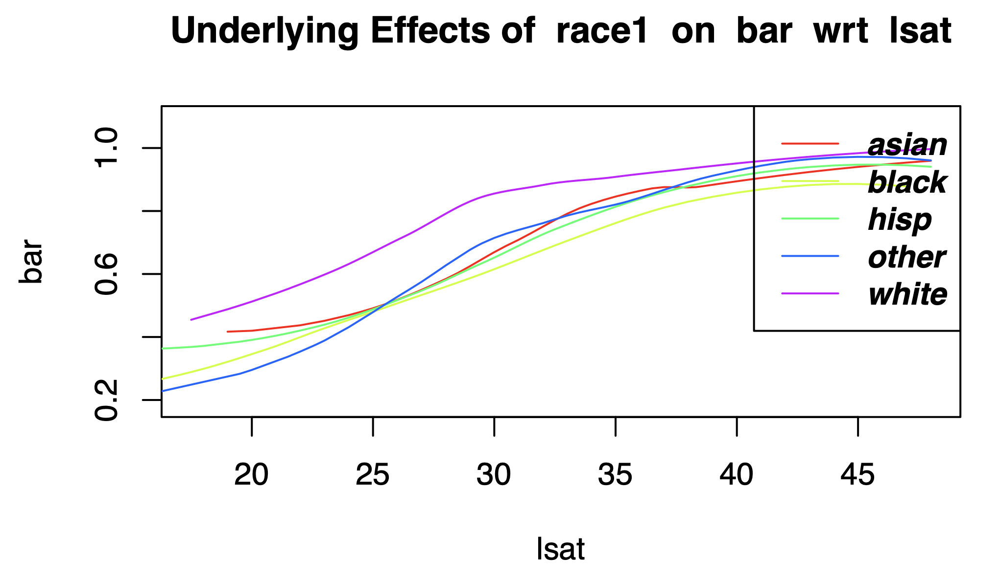

   
---
title: "Quick Start"
output:
   rmarkdown::html_vignette
vignette: >
  %\VignetteIndexEntry{Quick Start}
  %\VignetteEngine{knitr::rmarkdown}
  \usepackage[utf8]{inputenc}
---

```{r, include = FALSE}
knitr::opts_chunk$set(
  collapse = TRUE,
  comment = "#>"
)
```


# The dsld Package: Analysis of Discrimination

</br>
</br>
</br>

# What this package is about

Discrimination, be it racial, gender, age or whatever, is often a major
topic, and a natural application of Data Science. This package consists of
graphical and analytical methods toward this end.

The package enables two quite different aspects of discrimination
involving a sensitive variable S:

* The classical issue: Are two individuals, identical in all respects X
  other than the sensitive variable S, treated differently in terms of
  some response variable Y? For instance, do men and women of the same
  education, occupation and age (X) have the same mean for wage Y?

* Fairness in machine learning (ML): Say we are using an ML method,
  ranging from ordinary linear regression modeling to deep learning, to
  predict a variable Y from variables X. Is that prediction influenced
  by a sensitive variable S?  A credit institution, say, may wish to
  predict whether a loan would be repaid, Y, based on various credit
  numbers X for the applicant. The question is whether that prediction
  is influenced by sensitive variables S such as race and gender.

# Form of the package

Many of the functions in the package are wrappers for functions in
base-R, **qeML** or other packages, with the wrappers adding
discrimination analysis-specific features. For example, **dsldLinear**
wraps the standard R linear model function **lm** (via **qeLin**), but
adds dummy variables for the levels of the sensitive variable S, and
forms standard errors for their difference. It also allows the user to
specify that interaction terms be added between X and S.  If say S is
race, this enables comparison between Black and white, Black and
Hispanic and so on.

Care has been taken to design a uniform interface to **dsld** functions.
In most cases, the first three arguments are 

* **data**, a data frame, data
table or tibble 

* **yName**, the name of the column containing the
response variable Y 

* **sName**, specifying the name of the column 
corresponding to the sensitive variable .  

Most functions are paired with generic **predict**
functions, and in some cases with generic **plot**.

# Example

Consider the dataset **lsa**, built into **qeML**, a modified version of
the dataset **law.school.admissions** that is a common example in ML
circles. 

Running

``` r
data(lsa)
names(lsa)
```

shows the predictors as age, two decile scores for first- and third-year
law school grades, and so on. (This is of course an observational
dataset.  While there may be methodological issues---possible collider
effect, "predicting" the past etc.--here we are simply demonstrating the
software.)

We'll take Y to be LSAT score, with S being race. There has been concern
that the LSAT and other similar tests are biased against Black and
Latino students, and might otherwise have racial issues. Let’s
investigate, using **dsld**, trying a linear model.

``` r
z <- dsldLinear(lsa,'lsat','race1')
summary(z)
```

So again, Y is the LSAT score, S is race and the X variables are the
remaining columns.  Note that factor variables have been converted to
dummies such as **race1black**.  LSAT scores in this dataset ranged from
11 to 48 points. 

We can use the generic **summary** function to inspect coefficients and
other output. Let's look at two in particular, **fam_inc** and
**race1black**, whose estimated coefficients are 0.3009 and -4.7483,
respectively, with standard errors of about 0.0360 and 0.1981.  

Family income here is reported in quintiles. We see that the difference
between, say, the 3rd and 4th quintiles in terms of mean LSAT is about
0.3 point.  By contrast, being African-American (relative to the
default, which happens to be Asian here) accounts for a mean difference
of nearly 5 points.

This is of interest in a couple of aspects. Though test scores do tend
to be correlated with family income and indeed that 0.3 number is
statistically significant, its practical significance is very small.
Second, the data suggest that---even restricting attention to people who
come from, say, middle class families, have done well in law school and
passed the bar examination--African-Americans fare poorly on the LSAT.
This does not necessarily imply that there is "something wrong" with the
LSAT, but it does call for investigation.

What about Black vs. white scores? As noted, here is an example of the
extra capabilities that **dsldLinear** adds to the base-R **lm**.
Running

``` r
summary(z)$`Sensitive Factor Level Comparisons`
```

we find that the difference in dummy variables for Black and white
scores is about 6.0000 points with a standard error of 0.1410. The other
differences are reported as well.

# Graphical/tabular operations

The package includes an extensive set of functions for graphical and
tabular operations. For instance, continuing the law school example,
consider the code

``` r
dsldConditDisparity(lsa,'bar','race1','lsat')
```

{width=50%}

Notably, all the nonwhite groups exhibited similar outcomes. However,
all the groups, both white and nonwhite, converge
at the higher LSAT score.  

# Associated textbook

The package is paired with a [free Quarto
textbook](https://htmlpreview.github.io/?https://github.com/matloff/dsldBook/blob/main/_book/index.html).
The book is not an extended user manual for the package; instead, it is
a presentation of the underlying concepts, using the package to
illustrate those concepts.,

# Full function list, by category

Type **vignette('Function_list')**.

